AI Ops 测试

测试时间:2025/3/17

# 1)	测试说明

测试版本: SMS R82  hotfix take12(该原始版本R81.20 upgrade之后版本) ; GW: R81.20

# 2)	配置步骤

	1)	注册infinity portal 账号

	2)	通过smartconsole登录SMS 获取token
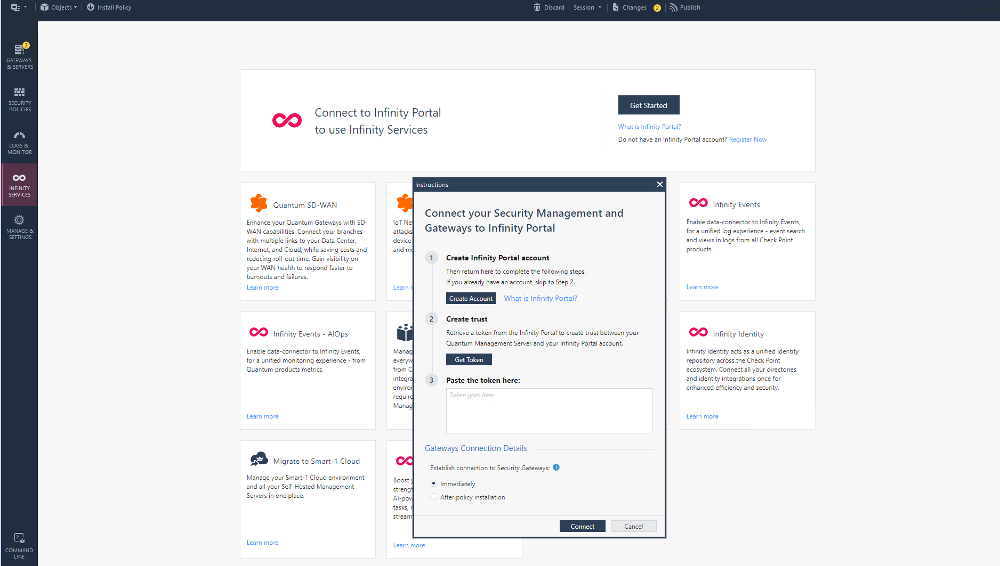
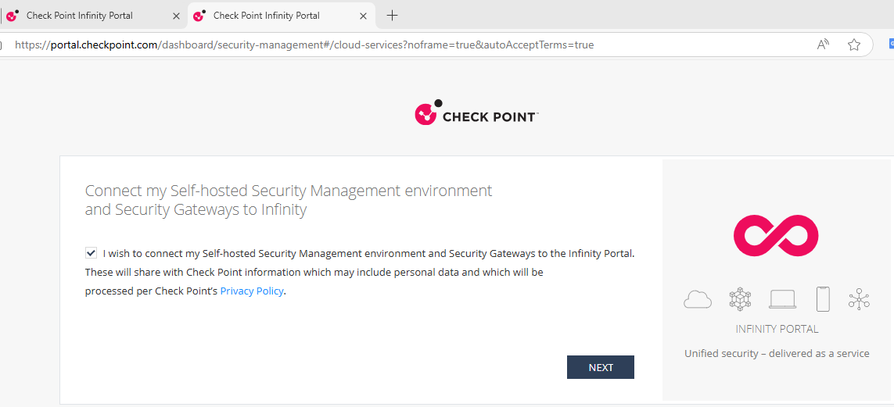

登录infinity portal 获取token，复制token 到如下界面 
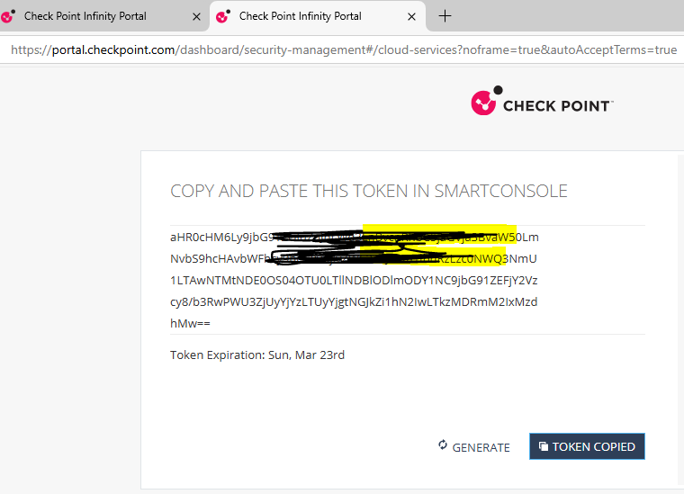
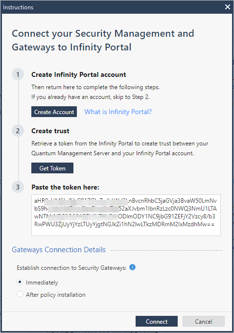
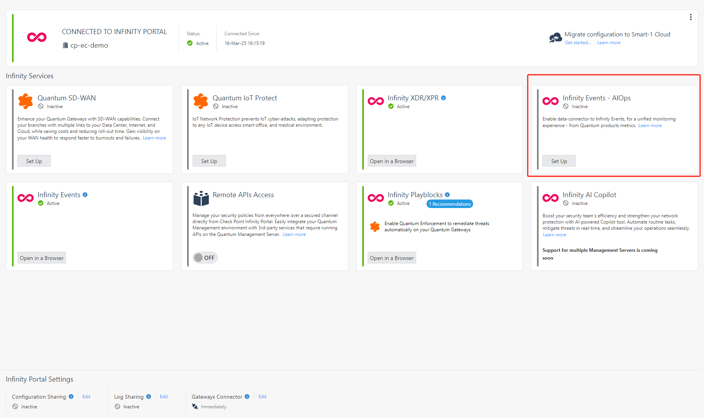
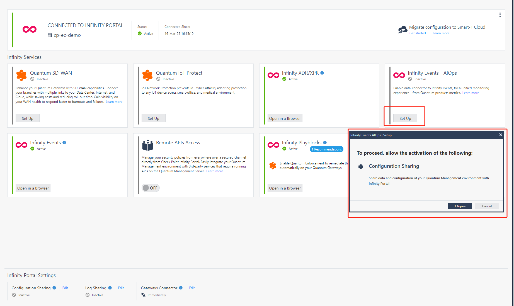
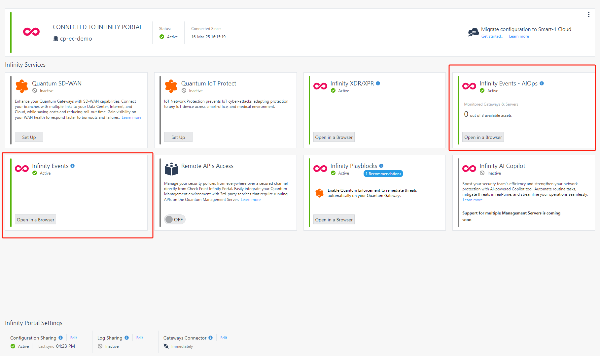

导入AIops 脚本，修改脚本权限并执行。
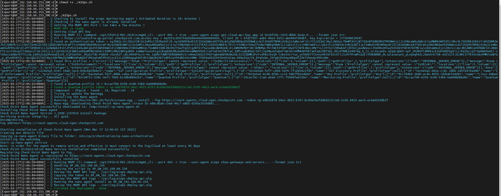

如需重新添加GW可执行如下命令
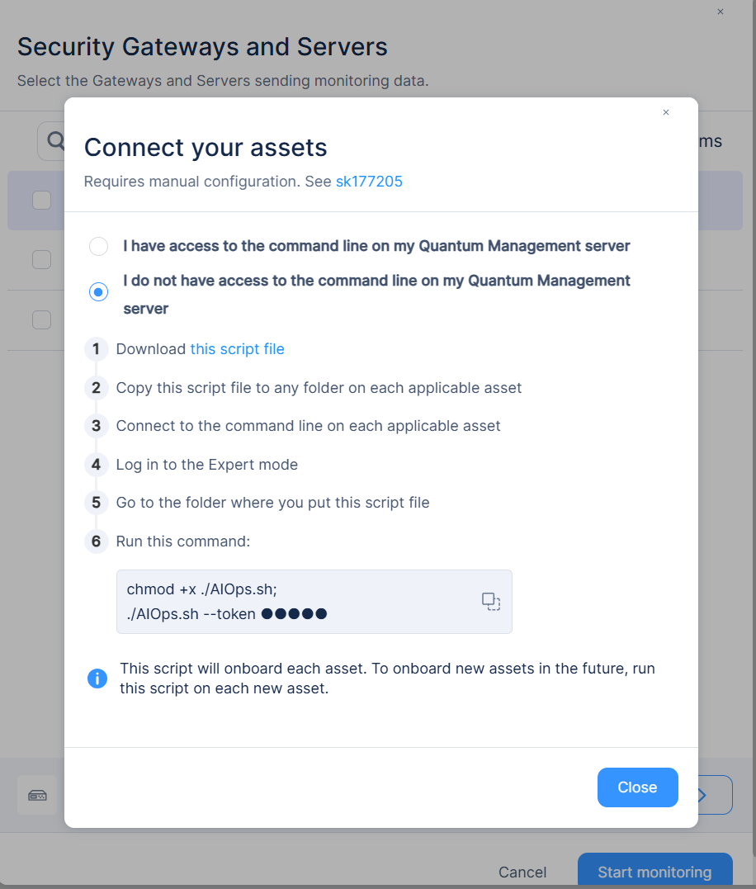
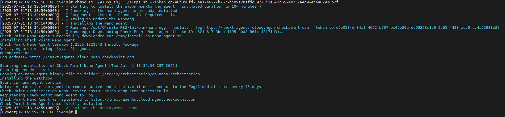
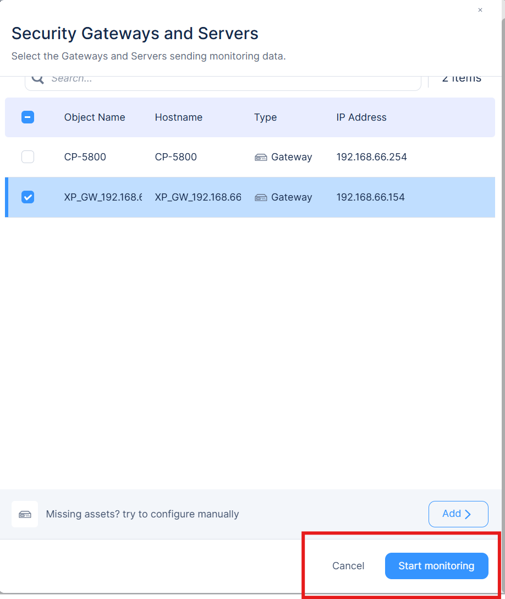

GW添加成功
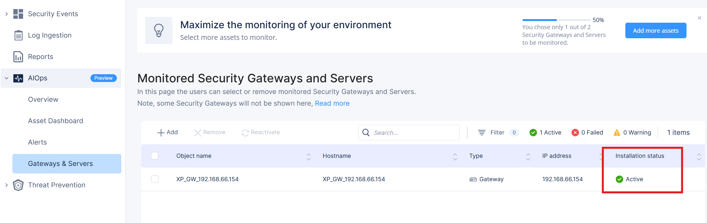
