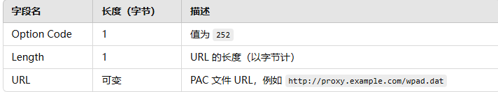
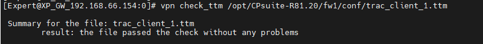
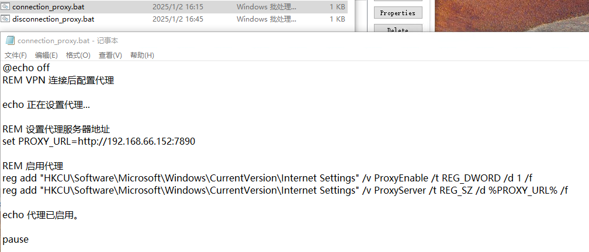
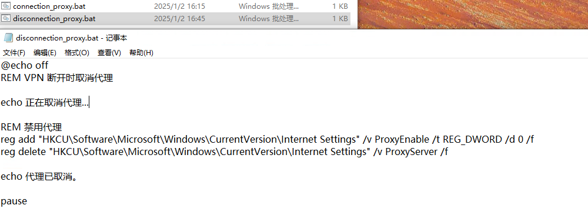

## 背景与目标

在某些环境中，Remote Access VPN 拨入后无法获取 DHCP 携带的 Option 252（WPAD）。且已确认网关不支持下发该选项。本文通过“连接后/断开后脚本”的方式，在客户端自动设置与取消代理，达到与 Option 252 类似的效果。

## DHCP Option 252 简介

DHCP Option 252 用于下发 WPAD URL，指导客户端自动获取 PAC 文件路径，从而自动配置代理。

示意图：



## 配置：连接后脚本（Post Connect Script）

### 在 SmartConsole/GuiDBEdit 中启用窗口显示

- 关闭所有 SmartConsole 窗口  
- 使用 GuiDBEdit 连接到安全管理服务器/域管理服务器  
- Table: Global Properties → global_properties → firewall_properties  
- 查找并确保 `desktop_post_connect_script` 为空  
- 将 `desktop_post_connect_script_show_window` 设置为 `true`（显示窗口）  
- Save All，关闭 GuiDBEdit  
- 使用 SmartConsole 重新连接并在每个网关/集群对象上安装策略

### 修改 TTM 文件（为连接后脚本指定路径）

编辑 `$FWDIR/conf/trac_client_1.ttm`：

```bash
cp -v $FWDIR/conf/trac_client_1.ttm{,_BKP}
vi $FWDIR/conf/trac_client_1.ttm
```

添加/调整以下段落（Windows 客户端脚本路径示例）：

```
:post_connect_script_show_window (
  :gateway (desktop_post_connect_script_show_window
    :valid (false)
    :default (false)
  )
)

:post_connect_script (
  :gateway (desktop_post_connect_script
    :valid (false)
    :default ("C:\connection_proxy.bat")
  )
)
```

保存并验证：

```bash
vpn check_ttm $FWDIR/conf/trac_client_1.ttm
```

验证示意：



> 说明：新设置在客户端下一次连接网关时生效。

## 配置：断开后脚本（Post Disconnect Script）

### 修改 TTM 文件（为断开后脚本指定路径）

在 `$FWDIR/conf/trac_client_1.ttm` 中增加：

```
:post_disconnect_script_show_window (
  :gateway (desktop_post_disconnect_script_show_window
    :valid (false)
    :default (false)
  )
)

:post_disconnect_script (
  :gateway (desktop_post_disconnect_script
    :valid (false)
    :default ("C:\disconnection_proxy.bat")
  )
)

:post_disconnect_mode (
  :gateway (desktop_post_disconnect_mode
    :valid (false)
    :default (1)
  )
)
```

参数说明：

- `post_disconnect_script_show_window`: 是否显示脚本窗口（true/false，默认 false）
- `post_disconnect_script`: 客户端的脚本路径（默认空）
- `post_disconnect_mode`: 0=禁用；1=仅用户发起事件运行；2=所有事件运行

保存后在 SmartConsole 安装策略使之生效。

## 代理脚本示例

connection_proxy.bat（连接后启用代理）：

```bat
@echo off
REM VPN 连接后配置代理

echo 正在设置代理...

REM 设置代理服务器地址
set PROXY_URL=http://192.168.66.152:7890

REM 启用代理
reg add "HKCU\Software\Microsoft\Windows\CurrentVersion\Internet Settings" /v ProxyEnable /t REG_DWORD /d 1 /f
reg add "HKCU\Software\Microsoft\Windows\CurrentVersion\Internet Settings" /v ProxyServer /t REG_SZ /d %PROXY_URL% /f

echo 代理已启用。
pause
```



disconnection_proxy.bat（断开后禁用代理）：

```bat
@echo off
REM VPN 断开时取消代理

echo 正在取消代理...

REM 禁用代理
reg add "HKCU\Software\Microsoft\Windows\CurrentVersion\Internet Settings" /v ProxyEnable /t REG_DWORD /d 0 /f
reg delete "HKCU\Software\Microsoft\Windows\CurrentVersion\Internet Settings" /v ProxyServer /f

echo 代理已取消。
pause
```



## 注意与参考

- 脚本以用户级权限运行；如在 Windows 登录前进行 Secure Domain Login，则不支持运行连接后脚本。
- 可通过 GPO 或第三方桌管工具将脚本批量下发到客户端指定目录。
- 参考：sk180657 “Client is not compatible with the connected gateway.”、Configuring Post Connect Scripts

—
